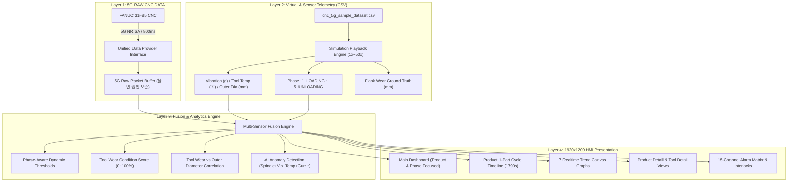

# IMPLEMENTATION PLAN (plan.md)
## 5G CNC 스마트 모니터링, 공구마모 및 가공품질 분석 시스템 v3.0
**Document:** Implementation Plan  
**Methodology:** SDD (Spec-Driven Development)  
**Standard Reference:** [spec.md v3.0](file:///c:/Users/1/Desktop/P14/spec.md), 5G 프롬프트.md & `cnc_5g_sample_dataset.csv`  
**Target Viewport:** 1920 × 1200 Tablet Landscape Display  

---

## 1. 아키텍처 및 3계층 데이터 파이프라인

---

## 2. 모듈별 구현 계획 (Phased Roadmap)

### Phase 1: 3계층 데이터 스키마 및 가상 CSV 시뮬레이션 엔진 고도화
* **목표**: 5G Raw Data + Virtual Telemetry (Phase, Vibration, Temp, Flank Wear Reference, Outer Dia) 통합.
* **주요 태스크**:
  * [x] **T1.1**: `js/cnc-schema.js`에 `machiningPhase`, `vibrationRmsG`, `toolTempC`, `flankWearReferenceMm`, `estOuterDiameterMm` 추가.
  * [x] **T1.2**: `js/cnc-simulator.js`에 CSV 900-row 데이터셋 재생 엔진 탑재 (5개 제품, 제품당 1,790초, 5단계 Phase 시뮬레이션).
  * [x] **T1.3**: `1X`, `5X`, `10X`, `50X` 가변 배속 재생, `[START]`, `[PAUSE]`, `[RESET]` 및 `DATA: 356/900` 진행 인디케이터 구현.
  * [x] **T1.4**: 데이터 갭(약 910초 비가공 인터벌) 및 데이터 출처 태그(`● LIVE 5G`, `● SIMULATION`, `● REFERENCE`, `● PREDICTED`) 바인딩.

### Phase 2: Multi-Sensor Fusion 공구 마모 & 품질 분석 엔진 개발
* **목표**: 서보 유효전류 + 스핀들 부하 + 진동 + 공구 온도 + 가공 단계를 융합한 지능형 마모 지수 산출.
* **주요 태스크**:
  * [x] **T2.1**: `js/tool-wear-engine.js`에 5대 센서 가중치 융합 공식 ($w_1=0.35, w_2=0.25, w_3=0.20, w_4=0.15, w_5=0.05$) 구현.
  * [x] **T2.2**: **Phase-Aware Dynamic Thresholds** 구현 (ROUGH TURNING 80% 부하는 정상 허용, FINISH TURNING 60%는 경보).
  * [x] **T2.3**: Reference Wear ($VB\text{ mm}$) vs Predicted Wear Index ($0\sim 100\%$) 오차 비교 및 모델 정확도(%) 계산.
  * [x] **T2.4**: 공구 마모 진행에 따른 가공 외경 치수($153.780 \sim 153.864\text{mm}$) 변화 상관관계 분석 및 AI 이상탐지(`TOOL WEAR SUSPECTED`) 플래그 처리.

### Phase 3: 1920×1200 태블릿 HMI 메인 대시보드 v3.0 재구성
* **목표**: 프롬프트 섹션 33의 레이아웃 사양을 100% 만족하는 제품 중심 다크 인더스트리얼 대시보드 완성.
* **주요 태스크**:
  * [x] **T3.1**: **Header**: VTL-01, ● CNC ONLINE, ● 5G CONNECTED, LATENCY 0.8s, SIMULATION 속도 제어기(1x~50x).
  * [x] **T3.2**: **Left (28%)**: Position X/Z/Rel/DTG, Program O3303, G-Code G01, Feed Rate / Override.
  * [x] **T3.3**: **Center (44%)**: Machine Status (● CUTTING), **CURRENT PHASE (ROUGH TURNING 대형 뱃지 & 진행률 바)**, Cycle Time (`00:18:40`), Progress (62%), Servo Effective Current (Raw -25A / MA / Peak).
  * [x] **T3.4**: **Right (28%)**: Spindle Speed (399 RPM), Spindle Load (CURRENT 84.5%, PEAK 86.96%), Part Count (5 / 1000 PCS), 누적 시간.
  * [x] **T3.5**: **Bottom Panels**:
    * **Bottom Left**: Vibration (2.31 g, PK: 2.78 g), Tool Temp (178.4℃, PK: 185.6℃).
    * **Bottom Center**: Tool ID (INSERT-T1-0001), Wear Ref (0.168 mm), Wear Index (82% Predicted), Canvas Waveform.
    * **Bottom Right**: Product ID (SHELL-20250602-05), Part (5), Est. Outer Dia (153.844 mm).
  * [x] **T3.6**: **Bottom Dock Nav**: `[MAIN]`, `[POSITION]`, `[SERVO]`, `[SPINDLE]`, `[TOOL]`, `[QUALITY]`, `[ALARM]`, `[HISTORY]`, `[SETTING]`.

### Phase 4: 7대 실시간 Canvas 트렌드 그래프 & 상세 분석 뷰 구현
* **목표**: 실시간 60fps 고성능 Canvas 파형 및 제품 상세 / 공구 상세 뷰 탑재.
* **주요 태스크**:
  * [x] **T4.1**: `js/hmi-charts.js`에 7대 트렌드 그래프(Spindle Load, Vibration, Temp, Servo Current, Tool Wear, Outer Dia, Cycle Time) 렌더러 탑재.
  * [x] **T4.2**: **Product Detail View**: 제품별 사이클 타임라인, 가공 단계별 부하/진동/온도 이력.
  * [x] **T4.3**: **Tool Detail View**: 인서트 누적 가공 수량, 피크 부하/진동, 추정 잔여 사이클 수량.
  * [x] **T4.4**: **Quality View**: 공구 마모 $\rightarrow$ 외경 치수 편차 상관관계 산포도 및 품질 경고.

---

## 3. 검증 및 테스트 계획 (Verification Checklist)

1. [ ] **Phase-Aware Threshold 검증**: ROUGH TURNING 단계에서 Spindle Load 82% 시 경보가 울리지 않고 정상 표시되는지 확인.
2. [ ] **Multi-Sensor Tool Wear Score 검증**: Servo Current, Vibration, Temp의 동시 상승 시 Wear Index 및 `TOOL WEAR SUSPECTED` 상태 검증.
3. [ ] **1x~50x 시뮬레이션 배속 검증**: 10x 배속 시 1초마다 CSV 레코드가 갱신되며 부드럽게 UI에 반영되는지 확인.
4. [ ] **외경 품질 및 Flank Wear Reference 표기 검증**: `● REFERENCE`와 `● PREDICTED` 뱃지 분리 표기 검증.
5. [ ] **1920×1200 시각적 시인성**: Dark Industrial HMI 테마에서 2~3초 내 상태 파악 가능 여부 확인.
