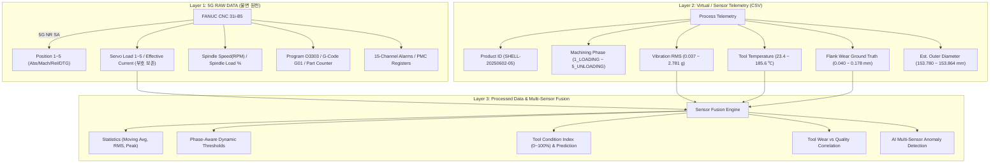

# SPECIFICATION DOCUMENT (spec.md)
## 5G 기반 CNC 수직선반 실시간 스마트 모니터링, 공구마모(Tool Wear) 및 가공품질 분석 HMI 시스템
**Version:** 3.0.0  
**Methodology:** SDD (Spec-Driven Development)  
**Target Platform:** 1920 × 1200 Tablet HMI (Landscape Mode)  
**Standard References:**
1. FANUC i-Series CNC 실제 모니터 사진 & HMI Spec
2. "CNC선반 5G 입력내용(2).xlsx" (5G 원천 텔레메트리 사양)
3. `cnc_5g_sample_dataset.csv` (가상 실시간 가공 데이터: 900 rows, 5 products, 1 tool, 10s sampling)

---

## 1. 시스템 개요 및 최종 목적 (System Overview & Objectives)

### 1.1 시스템 목적
본 시스템은 CNC 수직선반(VTL)에서 5G 통신망을 통해 실시간 전송되는 FANUC CNC 텔레메트리와 공정 센서 데이터를 융합하여, **"현재 제품 1개가 가공되는 순간의 상태"**, **"공정 단계(Machining Phase)별 거동"**, **"서보 유효전류/진동/온도 기반 공구 마모(Tool Wear)"**, **"가공 외경 품질(Quality)"**을 현장 오퍼레이터가 2~3초 내에 직관적으로 판단할 수 있는 산업용 스마트 HMI 모니터링 시스템을 구축하는 것을 목적으로 한다.

### 1.2 핵심 개발 개념 (Hierarchy of Dashboard Focus)
대시보드의 정보 계층은 전체 장비 상태보다 **"현재 가공 중인 제품 1개의 상태"**를 중심으로 구성된다:
$$\text{MACHINE} \longrightarrow \text{PRODUCT} \longrightarrow \text{CYCLE} \longrightarrow \text{MACHINING PHASE} \longrightarrow \text{TOOL CONDITION}$$

---

## 2. 3계층 데이터 아키텍처 (3-Layer Data Architecture)



---

## 3. 공정 단계(Machining Phase) 및 제품 사이클 명세

### 3.1 제품 1개 사이클 타임라인 (1,790초 기준)
각 제품(예: `SHELL-20250602-05`)은 총 1,790초(약 29분 50초) 동안 5단계 공정을 거치며, 화면 중앙에 대형 단계 표시 및 진행 바를 렌더링한다.

| 공정 단계 (Machining Phase) | 시간 범위 (초) | 평균 Spindle Load | 정상 Spindle Load 범위 | 정상 공구 온도 | 정상 진동 RMS |
| :--- | :--- | :--- | :--- | :--- | :--- |
| **1_LOADING** (공작물 장착/클램프) | $0 \sim 170\text{s}$ | $\sim 5\%$ | $0 \sim 15\%$ | $20 \sim 35\text{℃}$ | $< 0.1\text{g}$ |
| **2_ROUGH_TURNING** (외경/단면 황삭) | $180 \sim 710\text{s}$ | $\sim 81\%$ | $60 \sim 85\%$ (Warn: 85~90%) | $120 \sim 185\text{℃}$ | $1.2 \sim 2.8\text{g}$ |
| **3_FINISH_TURNING** (외경 정삭) | $720 \sim 1310\text{s}$ | $\sim 44\%$ | $30 \sim 55\%$ (Warn: 55~65%) | $90 \sim 140\text{℃}$ | $0.6 \sim 1.4\text{g}$ |
| **4_THREADING** (나사 가공) | $1320 \sim 1670\text{s}$ | $\sim 63\%$ | $45 \sim 70\%$ (Warn: 70~80%) | $110 \sim 160\text{℃}$ | $0.8 \sim 1.9\text{g}$ |
| **5_UNLOADING** (언클램프/반출) | $1680 \sim 1790\text{s}$ | $\sim 3\%$ | $0 \sim 10\%$ | $30 \sim 50\text{℃}$ | $< 0.1\text{g}$ |

> [!IMPORTANT]
> **Phase-Aware Threshold 원칙**: ROUGH TURNING 단계에서의 $81\%$ Spindle Load는 정상 가공 부하이며 알람이 아니다. 반드시 현재 공정 단계(Machining Phase)에 종속된 동적 임계값을 적용하여 오경보(False Alarm)를 방지한다.

---

## 4. Multi-Sensor 공구 마모(Tool Wear) 및 외경 품질 분석 명세

### 4.1 Ground Truth와 Model Prediction의 명확한 분리
1. **Flank Wear Reference ($VB$ in mm)**: CSV의 `flank_wear_vb_mm` ($0.040 \sim 0.178\text{mm}$)는 실시간 센서값이 아니라 **모델 검증 및 캘리브레이션을 위한 기준값(Ground Truth / Reference)**으로 취급하고 화면에 `● REFERENCE`로 명시한다.
2. **Estimated Tool Wear Index ($0 \sim 100\%$)**: 5개 핵심 센서 데이터의 실시간 융합 연산을 통해 예측된 값으로 `● PREDICTED`로 표시한다.

### 4.2 Multi-Sensor Fusion Score 공식
$$\text{Tool Condition Index} = w_1 \cdot \Delta I_{\text{servo}} + w_2 \cdot \Delta L_{\text{spindle}} + w_3 \cdot \text{Vib}_{\text{norm}} + w_4 \cdot \text{Temp}_{\text{norm}} + w_5 \cdot \text{PhaseFactor}$$
* **가중치**: Servo Effective Current ($35\%$), Spindle Load ($25\%$), Vibration RMS ($20\%$), Tool Temperature ($15\%$), Cycle & Phase ($5\%$)

### 4.3 마모 단계 및 시각화 기준
* `0 ~ 30%` : **NORMAL** (신품 공구)
* `30 ~ 50%` : **GOOD** (안정 절삭)
* `50 ~ 70%` : **WARNING** (마모 진행 중, 절삭 저항 상승)
* `70 ~ 85%` : **HIGH WEAR** (고마모 단계, 조도 저하 및 치수 변화 주의)
* `85 ~ 100%` : **TOOL CHANGE RECOMMENDED** (공구 수명 한계, 즉시 교체)

### 4.4 공구 마모와 외경 치수 품질(Outer Diameter Quality) 상관관계 분석
공구 마모 진행에 따른 가공 품질 저하 체인 모델을 분석 및 표시한다:
$$\text{Tool Wear } \uparrow \longrightarrow \text{Cutting Resistance } \uparrow \longrightarrow \text{Vibration \& Temp } \uparrow \longrightarrow \text{Est. Outer Diameter Variation } (153.780 \sim 153.864\text{mm})$$

### 4.5 AI Multi-Sensor 이상징후 탐지 (Anomaly Detection)
* 조건: $\text{Spindle Load } \uparrow + \text{Vibration } \uparrow + \text{Tool Temp } \uparrow + \text{Servo Current } \uparrow$ 동시 상승 패턴 감지 시
* 상태: 즉시 **`TOOL WEAR SUSPECTED`** 이상 상태 플래그 발생.

---

## 5. 시뮬레이션 및 데이터 품질 검증 명세 (Simulation Engine & Data Quality)

### 5.1 Simulation Playback 제어
* **샘플링 간격**: 기본 10초
* **배속 재생 지원**: `1X` (10초 주기), `5X` (2초 주기), `10X` (1초 주기), `50X` (200ms 주기)
* **제어 버튼**: `[START]`, `[PAUSE]`, `[RESET]`, `[1X]`, `[5X]`, `[10X]`, `[50X]`
* **상태 인디케이터**: `DATA: 356 / 900`, `TIME: 2025-06-02 09:12:30`

### 5.2 데이터 Gap 및 품질 검사
* 제품 간 약 910초의 비가공 시간 간격을 센서 오류가 아닌 `NON-MACHINING INTERVAL / DATA GAP`으로 정상 판정.
* 화면상 데이터 출처 태그 명시: `● LIVE 5G`, `● SIMULATION`, `● REFERENCE`, `● PREDICTED`.

---

## 6. 1920×1200 HMI 대시보드 레이아웃 명세

```
+---------------------------------------------------------------------------------------------------------------+
| HEADER: CNC SMART MONITOR | VTL-01 | ● CNC ONLINE | ● 5G CONNECTED | LATENCY: 0.8s | SIM CTRL (1x~50x) | CLOCK |
+---------------------------------------------------------------------------------------------------------------+
| LEFT (28%)                 | CENTER (44%)                                 | RIGHT (28%)                       |
| - Position (X: 110.880,    | - Machine Status: ● CUTTING                  | - Spindle: 399 RPM                |
|   Z: -71.884, Rel, DTG)    | - CURRENT PHASE: ROUGH TURNING [68%]         | - Load: CURRENT 84.5% / PEAK 86.9%|
| - Program: O3303           | - Cycle Time: 00:18:40 | Progress: 62%       | - Part Count: 5 / 1000 PCS        |
| - G-Code: G01 / Feed 0.25  | - Servo Effective Current: -25 A (MA/Peak)   | - Power/Oper/Cutting Accum Time   |
+----------------------------+----------------------------------------------+-----------------------------------+
| BOTTOM LEFT (28%)          | BOTTOM CENTER (44%)                          | BOTTOM RIGHT (28%)                |
| - VIBRATION: 2.31 g (PK: 2.78g) | - TOOL: INSERT-T1-0001                  | - PRODUCT: SHELL-20250602-05      |
| - TOOL TEMP: 178.4℃ (PK: 185℃)| - WEAR: 0.168 mm (Ref) | INDEX: 82% (Pred)| - PART: 5 / 5                     |
|                            | - Mini Waveform Canvas (Current vs Baseline) | - EST. OUTER DIA: 153.844 mm      |
+---------------------------------------------------------------------------------------------------------------+
| BOTTOM DOCK NAV: [MAIN] [POSITION] [SERVO] [SPINDLE] [TOOL] [QUALITY] [ALARM] [HISTORY] [SETTING]            |
+---------------------------------------------------------------------------------------------------------------+
```

---

## 7. 7대 실시간 트렌드 그래프 명세
1. **GRAPH 1**: Spindle Load % vs Time
2. **GRAPH 2**: Vibration RMS (g) vs Time
3. **GRAPH 3**: Tool Temperature (℃) vs Time
4. **GRAPH 4**: Servo Effective Current (A) vs Time
5. **GRAPH 5**: Tool Wear (mm Reference & % Prediction) vs Part Number
6. **GRAPH 6**: Outer Diameter (mm) vs Part Number
7. **GRAPH 7**: Cycle Time vs Part Number

---

## 8. 절대 금지사항 (Prohibitions)
1. `flank_wear_vb_mm`를 실시간 센서값이라고 호도하지 않는다.
2. Estimated Wear와 실측 Reference Wear를 혼동하여 표시하지 않는다.
3. Spindle Load 단일 센서만으로 Tool Wear를 단정하지 않는다.
4. ROUGH TURNING의 정상 부하(80%대)를 무조건 알람으로 처리하지 않는다.
5. Machining Phase를 배제한 단일 정적 임계값을 전체 공정에 적용하지 않는다.
6. 5G 통신망과 CNC 텔레메트리 자체를 동일시하지 않는다.
7. Simulation Data를 Live Data로 가장하여 표시하지 않는다.
